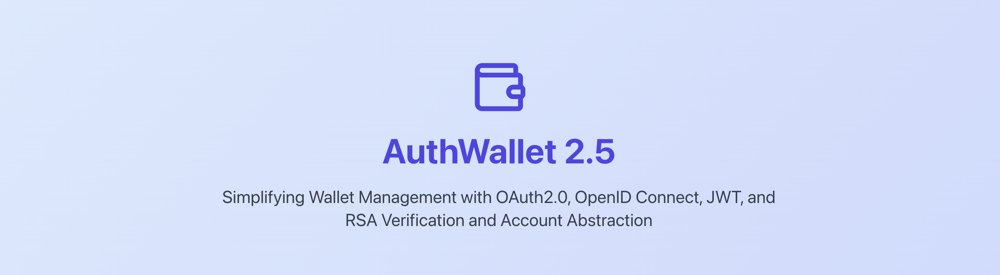
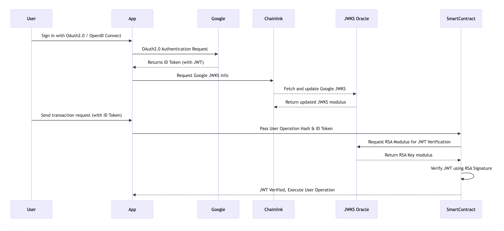

# AuthWallet 2.5

Simplifying Wallet Management with OAuth2.0, OpenID Connect, JWT, and RSA Verification and Account Abstraction

## Description

AuthWallet 2.5 revolutionizes the way users interact with Ethereum wallets by integrating OAuth2.0, OpenID Connect, JWT, and RSA verification. This user-friendly solution eliminates the need for complex private key management, making secure wallet interactions accessible to all users. With AuthWallet, users can send ETH by email, manage attestations, and execute cross-chain transactions with ease.

## How It Works

### Google JWKS Data Retrieval:

The application leverages Chainlink Functions and Chainlink Automation to securely fetch Google’s JSON Web Key Set (JWKS). These keys are used to verify JWTs signed by Google. The JWKS data is regularly updated to ensure the authenticity and integrity of the keys used in RSA signature verification for OAuth2.0 tokens.

### OAuth2.0 & OpenID Connect for User Sign-In:

Users authenticate via OAuth2.0 and OpenID Connect flows. Upon successful authentication, the user receives an ID Token containing key information, including an account abstraction user operation hash. This hash represents a cryptographic fingerprint of the user's intended transaction on the blockchain.

### Smart Contract JWT Verification:

The ID Token generated during sign-in contains a JWT. A dedicated smart contract verifies the JWT using RSA signature verification against the modulus fetched from the JWKS oracle. This ensures that the JWT is authentic and has been signed by Google. The contract interacts with the Chainlink-powered JWKS oracle to retrieve and validate the appropriate RSA keys used for signature verification.

### EIP-1193 Compatibility:

The AuthWallet 2.5 is fully compatible with EIP-1193: Ethereum Provider JavaScript API. It also supports modern Ethereum libraries like viem and wagmi, making it easy to integrate with decentralized applications (dApps). In this demo, we utilize RainbowKit to simplify the connection of AuthWallet 2.5 to the Ethereum network.

### Benefit

With AuthWallet 2.5, users do not need to have an existing wallet address to get started. This eliminates the barrier of requiring a wallet setup before onboarding, making it easier for new users to engage with the Ethereum ecosystem.

## Deployed Contracts

### OmniExecutor

https://sepolia.basescan.org/address/0x10B3b5a00053A8542cE22810D64B6621eC2Ab402#code

### JWKSAutomatedOracle

https://sepolia.basescan.org/address/0x0C764b9df1646958Ff5786fb08C7b59779e8ff6F#code

### AuthWalletFactory

https://sepolia.basescan.org/address/0xb15Ee99Cef27CCc46ca86bEDa2446Ee1C16655dD#code

### AuthWallet Implementation

https://sepolia.basescan.org/address/0xd6D82F312B4C97070E0090Dd53Dcdf1C257baAe1#code

## Other References

### Google Open ID Configuration

https://accounts.google.com/.well-known/openid-configuration

### JWKS URI

https://www.googleapis.com/oauth2/v3/certs

### Chainlink Functions

https://functions.chain.link/base-sepolia/170

### Chainlink Automation

https://automation.chain.link/base-sepolia/74644542916194546067825742734391644837565701576241258747285046204166351159434

### Created Sign Protocol Schema

https://testnet-scan.sign.global/schema/onchain_evm_84532_0x27e

### Successful Omnichain Execution Transaction

https://testnet.layerzeroscan.com/tx/0x977fca901bb77de21d3b7b49a359e29d6d4e595b1bf4eda88b153a2e02509672
